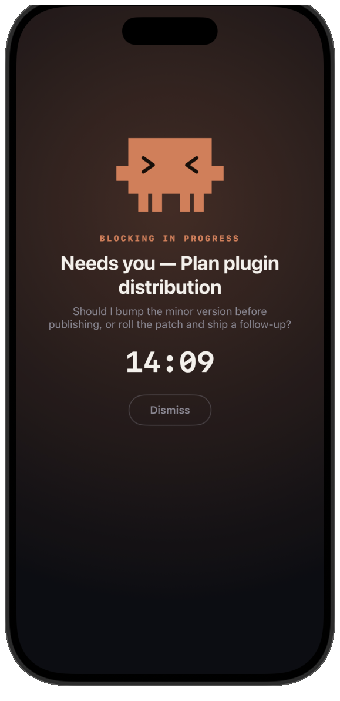
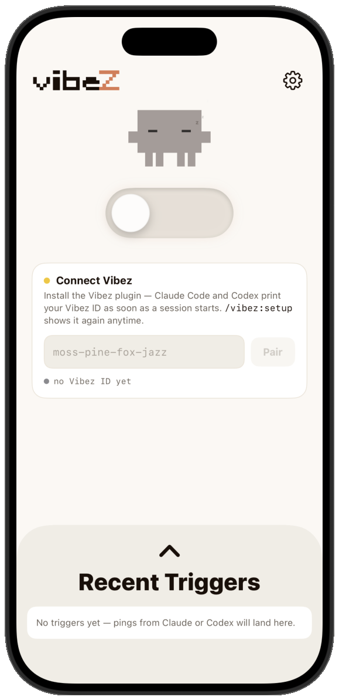
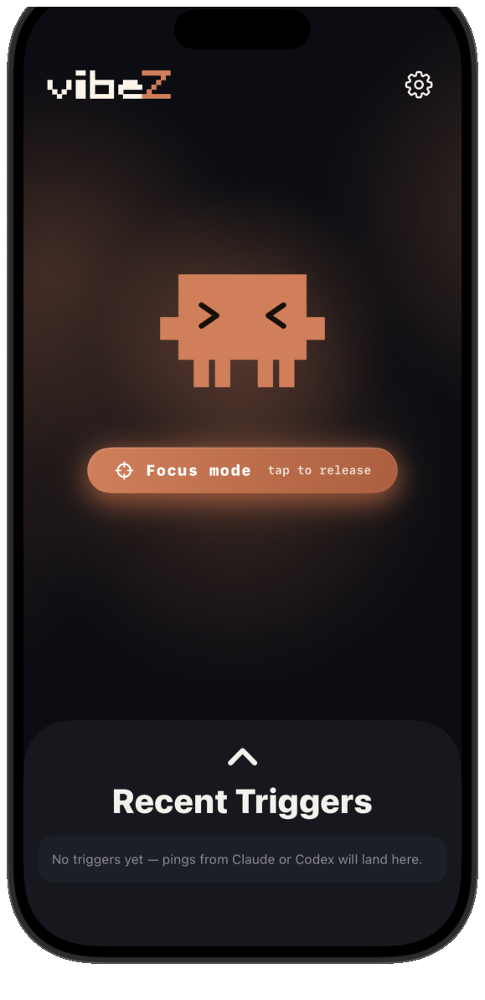
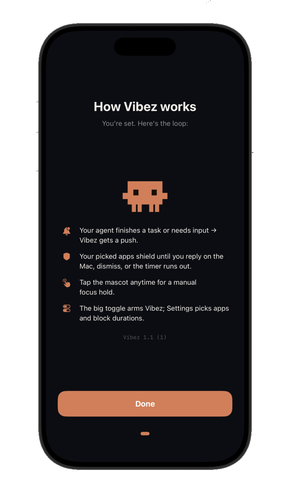

<div align="center">

<picture>
  <source media="(prefers-color-scheme: dark)" srcset="assets/wordmark/wordmark-dark.svg">
  <source media="(prefers-color-scheme: light)" srcset="assets/wordmark/wordmark-light.svg">
  
</picture>

**Block distracting apps when your coding agent needs you back.**

Vibez connects Claude Code and Codex lifecycle events to an iOS Screen Time shield. When your agent stops, asks for permission, or needs a reply, your selected apps lock until you return.

<sub>iOS Screen Time API · Claude Code plugin · Codex plugin · Firebase Cloud Messaging</sub>

<br><br>

<a href="ClaudePlugin/README.md"></a>
<a href="CodexPlugin/README.md"></a>
<a href="https://apps.apple.com/us/app/ai-coding-focus-vibez/id6775433780"></a>

<br><br>






</div>

## What It Does

Coding agents create a weird failure mode: the work is automated, but your attention is still the bottleneck. Vibez turns agent idle states into a phone-side block signal.

| Agent event | Vibez plugin | iOS app |
|---|---|---|
| First session after install | Generates a private 4-word Vibez ID and prints it. | Enter the ID once in the Setup card to pair this Mac with your phone. |
| Permission request, question, or idle prompt | Sends a `needs-input` push with `shield:on`. | Records the trigger, shows the message, and applies the Screen Time shield. |
| Agent stops after a response | Sends a `done` push with a short assistant excerpt and `shield:on`. | Keeps selected apps blocked for the configured window. |
| You submit the next prompt | Sends a `replied` push with `shield:off`. | Clears that session's trigger and lifts the shield when no triggers remain. |

The Claude Code and Codex plugins share one Vibez ID at `~/.config/vibez/vibez-id`, so a single pairing on your phone covers both agents.

## Components

| Path | Status | Purpose |
|---|---|---|
| [`ClaudePlugin/`](ClaudePlugin/) | Working | Claude Code plugin for `SessionStart`, `Notification`, `PreToolUse`, `PostToolUse`, `Stop`, and `UserPromptSubmit` hooks. |
| [`CodexPlugin/`](CodexPlugin/) | Working | Codex plugin for `SessionStart`, `PermissionRequest`, `PreToolUse`, `PostToolUse`, `Stop`, and `UserPromptSubmit` hooks. |
| [`Vibez/`](Vibez/) | [On the App Store](https://apps.apple.com/us/app/ai-coding-focus-vibez/id6775433780) | SwiftUI iOS app that receives FCM pushes, records recent triggers, and applies Family Controls / Managed Settings shields. |
| [`Backend/`](Backend/) | Working | Firebase Cloud Functions (`registerPushToken`, `notify`, `dispatchUnblock`) that pair devices and fan out pushes via FCM. |
| [`VibezExtension/`](VibezExtension/) | Local build | Chrome (MV3) extension that mirrors the block on desktop browsers. |
| [`assets/`](assets/) | Working assets | Logo, glyph, icon, and README artwork. |

## Install Agent Plugins

Install either plugin, or install both. They pair to the same Vibez ID automatically.

### Claude Code

```sh
/plugin marketplace add Peter-Zhao-751/Vibez
/plugin install vibez@plugin
```

Then open Claude Code. The first session prints your private 4-word Vibez ID. Run `/vibez:setup` to show it again, or `/vibez:setup test` to send a test push.

Full details: [`ClaudePlugin/README.md`](ClaudePlugin/README.md)

### Codex

```sh
codex plugin marketplace add Peter-Zhao-751/Vibez
codex plugin install vibez@vibez
```

Then open Codex. The first session prints your private 4-word Vibez ID. You can later ask Codex to show your Vibez ID or send a test push.

Full details: [`CodexPlugin/README.md`](CodexPlugin/README.md)

## iOS App

**[AI Coding Focus — Vibez](https://apps.apple.com/us/app/ai-coding-focus-vibez/id6775433780)** is free on the App Store.

The app is built around Apple's `FamilyControls` and `ManagedSettings` frameworks:

1. Enter your 4-word Vibez ID.
2. Grant notification permission.
3. Grant Screen Time / Family Controls permission.
4. Pick the apps, categories, or websites to shield.
5. Leave Vibez enabled while your agent works.

Building from source instead needs a paid Apple Developer Program team because Apple does not grant the `family-controls` entitlement to personal teams. The simulator is useful for compile checks, but Screen Time shields are no-ops there.

## Configuration

Both plugins read the same optional environment overrides:

| Variable | Default | Purpose |
|---|---|---|
| `VIBEZ_ID` | from `~/.config/vibez/vibez-id` | Force a specific Vibez ID — e.g. to drive several machines from one ID without copying the file. |
| `VIBEZ_BACKEND_URL` | `https://us-central1-vibez-backend.cloudfunctions.net` | Point the plugins at a different Firebase deployment. |

The generated Vibez ID and a debug log live in `~/.config/vibez/`.

## Privacy

Your Vibez ID is a shared secret: anyone who learns it can push notifications — and raise shields — on your phone. The four-word ID carries ~44 bits of entropy, enough to make guessing impractical, but rotate it with `/vibez:setup regenerate` if it ever appears in a screenshot, stream, log, or shared terminal.

The push pipeline runs on the project owner's Firebase project. The APNs auth key (`.p8`) lives in Firebase Cloud Messaging and never ships to clients.

See the full [Privacy Policy](PRIVACY.md) for what data the iOS app handles and what stays on your device.

## Repo Layout

```text
Vibez/
├── Vibez/                  iOS app (SwiftUI, Screen Time API)
├── VibezShield/            Shield Configuration Extension (custom shield UI)
├── VibezPushService/       Notification Service Extension (engages the shield pre-banner)
├── ClaudePlugin/           Claude Code plugin
├── CodexPlugin/            Codex plugin
├── Backend/                Firebase Cloud Functions (push fan-out + scheduling)
├── VibezExtension/         Chrome (MV3) browser companion
├── assets/                 Logos, icons, lockups, glyphs, app mockups
├── docs/                   Design notes and implementation plans
├── Vibez.xcodeproj/
└── CLAUDE.md               Project context for agent sessions
```

## Current Status

- Claude Code plugin: working.
- Codex plugin: working.
- iOS app: [free on the App Store](https://apps.apple.com/us/app/ai-coding-focus-vibez/id6775433780).

## License

TBD.

<div align="center">

<br>

<picture>
  <source media="(prefers-color-scheme: dark)" srcset="assets/glyph/pixel-z-cream.svg">
  <source media="(prefers-color-scheme: light)" srcset="assets/glyph/pixel-z-ink.svg">
  
</picture>

<br>

<sub>Built by <a href="https://github.com/Peter-Zhao-751">@Peter-Zhao-751</a>.</sub>

</div>
