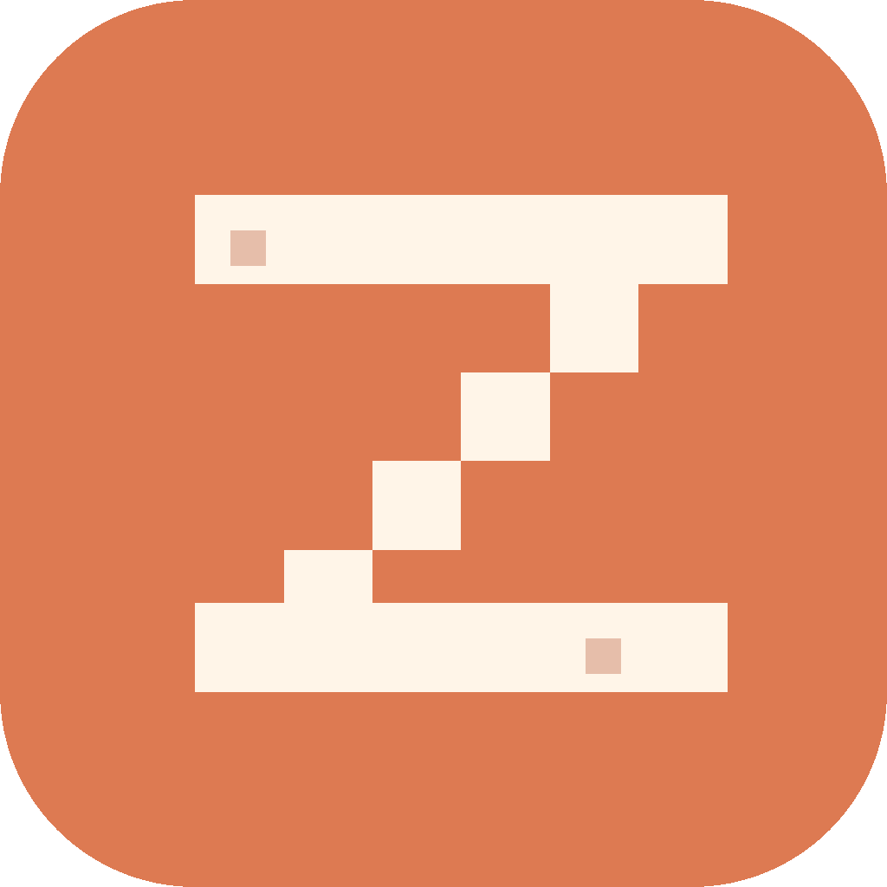

<div align="center">

<picture>
  <source media="(prefers-color-scheme: dark)" srcset="assets/lockups/vibez-lockup-dark.svg">
  
</picture>

### the only productivity app for people who let an AI do their job

**Vibez blocks Instagram, TikTok, Reels, and the rest of the slot machine on your phone — but only while Claude is waiting for you.** The second your agent stops or asks a question, the apps lock. The second you reply, they unlock. Doomscroll on agent time, focus on human time.

<sub>iOS · Screen Time API · Claude Code plugin · ntfy push</sub>

<br>

<a href="#-install-the-claude-side"></a>
<a href="#-install-the-ios-app"></a>

</div>

---

## the situation, 2026

You're a self-respecting senior engineer. You have a Claude subscription. You have taste. You have a sprint deadline.

You also have, statistically speaking, **47 minutes of TikTok logged today** and it's only lunchtime, because every time Claude says

> _"Should I run `npm install` to add the new dependency? (y/n)"_

your thumb is already on the home button before your prefrontal cortex catches up. Forty seconds become forty minutes. Your agent finished six tasks ago. The build is green. You are still watching a labrador eat a strawberry.

This is the year of our Lord 2026 and you are not going to fix this with willpower.

## what vibez does

<table>
<tr>
<td width="50%" valign="top">

**On your Mac**
Claude Code plugin. Hooks into `SessionStart`, `Notification`, and `Stop`. When Claude asks a question or finishes a task, the plugin fires a push notification at your phone via [ntfy.sh](https://ntfy.sh).

</td>
<td width="50%" valign="top">

**On your phone**
A native iOS app. Uses Apple's Screen Time / Family Controls APIs to shield the apps **you** picked (Instagram, TikTok, Reels, Twitter, whatever your poison is). Toggle on → shielded. Toggle off → unshielded.

</td>
</tr>
<tr>
<td colspan="2" align="center">

**The bridge:** the push from your Mac flips the toggle. Agent goes idle → toggle on → your apps are dead. You answer Claude → toggle off → scroll like a free citizen until the next `npm install` prompt.

</td>
</tr>
</table>

<div align="center">


</div>

## the events

| When Claude does this | Vibez does this |
|---|---|
| **Starts a session** (first run) | Shows you the subscribe URL inline so you can pair your phone. |
| **Asks for input** ("Permission required to run…") | High-priority push. The actual question is in the title. Your reels die. |
| **Finishes a task** (Stop) | Default-priority push with a ~160-char excerpt of Claude's last message. Apps stay shielded until you come back. |
| **Is happily working** | Nothing. The phone is yours. Touch grass. Or don't. |

## install: the claude side

Available right now. This part actually works.

**1.** Get the [ntfy app](https://ntfy.sh/app) on your phone (iOS / Android / web).

**2.** Optional, for the inline QR: `brew install qrencode`

**3.** In Claude Code:

```sh
/plugin marketplace add Peter-Zhao-751/Vibez
/plugin install vibez@plugin
```

**4.** Open Claude Code as normal. The first session prints a banner with your private subscribe URL.

**5.** Run `/vibez:setup` to show the URL again with an inline QR. Open ntfy on your phone → tap **+** → scan it.

**6.** Verify with `/vibez:setup test`. You should get a push within a second or two.

Full plugin docs (env vars, self-hosted ntfy, slash commands, failure modes) live in [`ClaudePlugin/README.md`](ClaudePlugin/README.md).

## install: the iOS app

> **Coming soon to the App Store.** ™
>
> Status: backend compiles clean against iOS 26.4, `FamilyControls` + `ManagedSettings` shields work end-to-end, state survives app kill. Currently blocked on a paid Apple Developer Program enrollment ($99/yr) — Apple gates the `family-controls` entitlement so personal teams literally cannot ship this. Once enrolled, App Store distribution additionally needs the Family Controls Distribution Request form (~3-week review).
>
> Translation: the code is done. The bureaucracy is not. If you want to build it locally on a paid team, clone the repo, open `Vibez.xcodeproj`, set your team in Signing & Capabilities, and run on a real device. (Shields are no-ops in the simulator — Apple's rule, not ours.)

When it ships, the flow will be:

1. Install Vibez from the App Store.
2. Grant Screen Time / Family Controls permission.
3. Tap the picker → pick the apps that own you.
4. Done. The Claude plugin handles the rest.

## why not just… use willpower

Look at yourself.

## why not Apple's Focus modes / Screen Time limits

Focus modes are static schedules — they don't know your agent just stopped. Screen Time limits are daily budgets, not "block this for the next 90 seconds while I read what Claude wrote." Vibez is **event-driven**, scoped to the exact window where you're least likely to resist a 30-second video.

## brand kit

<table>
<tr>
<td align="center"><br><sub>primary mark</sub></td>
<td align="center"><br><sub>italic z</sub></td>
<td align="center"><br><sub>waveform</sub></td>
<td align="center"><br><sub>monogram</sub></td>
</tr>
</table>

**Palette**

<table>
<tr>
<td></td><td><code>#dd7a52</code></td><td>orange</td>
<td></td><td><code>#b85a36</code></td><td>orange deep</td>
</tr>
<tr>
<td></td><td><code>#1a0e08</code></td><td>ink</td>
<td></td><td><code>#fff5e8</code></td><td>cream</td>
</tr>
</table>

Full asset inventory in [`assets/README.txt`](assets/README.txt).

## repo layout

```
Vibez/
├── Vibez/                  iOS app (SwiftUI, Screen Time API)
├── ClaudePlugin/           Claude Code plugin (hooks + ntfy)
├── assets/                 Logos, icons, lockups, glyphs
├── Vibez.xcodeproj/
└── CLAUDE.md               Project context for the agents
```

## status

- **Claude Code plugin** — shipping
- **iOS backend** — compiles, shields apply/remove correctly
- **Mac ↔ phone bridge** — currently push-driven via ntfy; deciding whether to add a deeper integration (URL scheme handoff, Shortcuts, etc.)
- **App Store release** — gated on Apple Developer Program enrollment + Family Controls distribution review

## license

TBD. For now: it's mine, be cool about it.

<div align="center">

<br>


<sub>built by <a href="https://github.com/Peter-Zhao-751">@Peter-Zhao-751</a> · pair-programmed with the very tool that demanded this app exist</sub>

</div>
